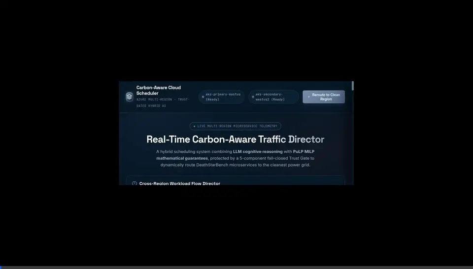
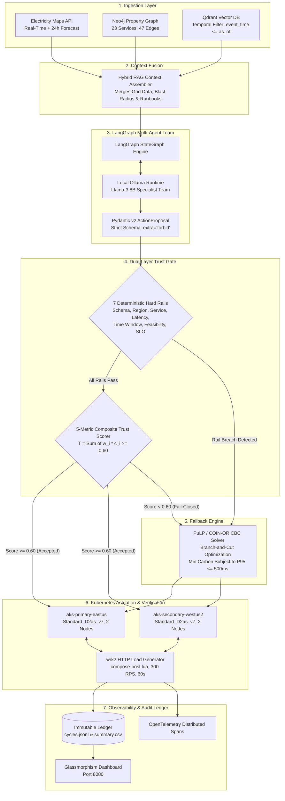

# Carbon-Aware Cloud Optimization: Multi-Region Trust-Gated Scheduler

Autonomous, carbon-intensity-aware microservice scheduling platform across multi-region Microsoft Azure Kubernetes Service (AKS) clusters. The system integrates real-time Electricity Maps grid telemetry, topological knowledge graphs (Neo4j), vector runbooks (Qdrant), a LangGraph multi-agent team (local Llama-3 via Ollama), a dual-layer fail-closed Trust Gate, and a deterministic Mixed-Integer Linear Programming (MILP) solver powered by PuLP and COIN-OR CBC.

---

## Demonstration Walkthrough



*Figure 1: Live operator dashboard demonstrating multi-region telemetry ingestion, cluster region activation, real-time LLM chain-of-thought reasoning streams, 5-component Trust Gate gating, adversarial fault injection, and microservice DAG service dispatch.*

Direct video link: [Download Full-Resolution Demonstration (MP4)](docs/assets/dashboard_demo.mp4)

---

## Executive Summary

Data center electricity consumption accounts for an increasing share of global carbon emissions. Grid carbon intensity varies substantially by geographic location and time of day (often oscillating between 140 and 650 gCO2eq/kWh depending on solar, wind, hydro, and fossil-fuel generation).

Existing approaches suffer from a fundamental dichotomy:
1. **Pure Mathematical Optimization (MILP):** Deterministic, mathematically provable safety, but completely blind to operational runbooks, semantic system context, and complex upstream/downstream microservice failure modes.
2. **Pure Large Language Model (LLM) Scheduling:** Highly adaptable and capable of contextual reasoning, but inherently prone to hallucinations, non-deterministic scheduling jitter, and catastrophic policy or SLA violations on live production clusters.

**Our Solution:** A **Trust-Gated Hybrid Framework** that unifies LLM adaptability with deterministic mathematical safety:
- **Module 1 (Carbon Intelligence & Hybrid RAG):** Ingests live marginal carbon intensity from Electricity Maps with SHA-256 verifiable caching, maps the 23-microservice DeathStarBench Social Network topology in Neo4j, and searches operational runbooks in Qdrant using strict point-in-time temporal filtering (`event_time <= as_of`).
- **Module 2 (Trust-Gated Multi-Agent Scheduler):** Orchestrates domain-specialized agents (Carbon Analyst, SLO Guardian, Scheduler) using LangGraph and local Llama-3. Every proposal is subjected to a dual-layer Trust Gate (7 deterministic hard rails + 5-component weighted trust score). Any failure instantly triggers a fail-closed fallback to the PuLP MILP solver.
- **Module 3 (Kubernetes Actuation & Observability):** Directly actuates dual Azure AKS clusters (`aks-primary-eastus` in Virginia and `aks-secondary-westus2` in Washington), runs automated pre-flight database fixture resets, executes `wrk2` HTTP stress benchmarking, and persists immutable cryptographic audit receipts (`cycles.jsonl`, `summary.csv`).

---

## End-to-End System Architecture



---

## Detailed Module Breakdown

### Module 1: Carbon Intelligence & Hybrid RAG Layer
1. **Real-Time Telemetry & Forecast Ingestion (`src/carbon_scheduler/carbon_client.py`):**
   - Continuously polls real-time marginal carbon intensity (gCO2eq/kWh) and 24-hour predictive horizons for `US-MIDA-PJM` (Azure East US) and `US-NW-BPAT` (Azure West US 2).
   - Generates SHA-256 integrity checksums for every response and caches them on disk in `data/carbon_cache/` for cryptographic auditability.
2. **Topological Microservice Knowledge Graph (`src/carbon_scheduler/graph_ingest.py`):**
   - Encodes the complete DeathStarBench Social Network architecture (23 microservices, 47 dependency edges, Thrift RPC calls, MongoDB databases, Memcached instances, and Redis clusters) in Neo4j.
   - Executes recursive k-hop graph traversals to evaluate upstream caller impact and downstream dependency blast radius before any scheduling decision is made.
3. **Temporal Vector Indexing & Context Retrieval (`src/carbon_scheduler/retrieval.py`):**
   - Indexes operational runbooks, incident post-mortems, and historical latency catalogs in Qdrant using vector embeddings.
   - Enforces strict point-in-time temporal filtering (`event_time <= decision_time`), preventing future benchmark metrics from leaking into scheduling context.

### Module 2: Trust-Gated Multi-Agent Scheduler
1. **LangGraph Multi-Agent Team (`src/carbon_scheduler/agent.py` & `workflow.py`):**
   - Orchestrates a 6-node state machine (`collect_context`, `propose_action`, `evaluate_trust`, `choose_final_action`, `execute`, `record_result`).
   - Runs local Llama-3 (8B) via Ollama, translating carbon and graph telemetry into strict Pydantic v2 `ActionProposal` objects with `extra="forbid"`.
2. **Dual-Layer Fail-Closed Trust Gate (`src/carbon_scheduler/trust.py`):**
   - **Layer 1 (7 Deterministic Hard Rails):**
     - `action_schema`: Validated JSON syntax and mandatory fields.
     - `target_region`: Whitelisted candidate regions (`eastus`, `westus2`).
     - `target_service`: Verified existence in the active graph topology (`nginx-thrift`).
     - `latency_estimate`: Non-zero expected latency declaration.
     - `decision_window`: Scheduled execution within valid time horizon (`earliest_start <= t <= deadline`).
     - `execution_feasibility`: Target cluster connectivity verified.
     - `latency_slo`: Expected tail-latency strictly below threshold ($P95 \le 500\text{ ms}$).
   - **Layer 2 (5-Component Weighted Trust Scorer, Threshold $T = 0.60$):**
     - RAGAS Faithfulness ($w = 0.20$): Evaluates whether rationale is grounded in retrieved context.
     - RAGAS Context Precision ($w = 0.20$): Evaluates signal-to-noise ratio of retrieved knowledge.
     - NeMo Guardrails ($w = 0.20$): Validates operational boundary compliance.
     - Data Freshness ($w = 0.20$): Penalizes telemetry older than the 5-minute polling window.
     - Execution Feasibility ($w = 0.20$): Verifies target cluster resource quota and node readiness.
3. **Deterministic PuLP MILP Fallback Engine (`src/carbon_scheduler/milp.py`):**
   - Implements binary integer linear programming solved via the COIN-OR CBC Branch-and-Cut solver.
   - Mathematically minimizes cumulative carbon intensity subject to hard completion deadlines, regional node capacities, and tail-latency constraints ($P95 \le 500\text{ ms}$). Solve time is consistently under 5 milliseconds.

### Module 3: Kubernetes Actuation & Observability
1. **Multi-Region Azure AKS Actuation (`src/carbon_scheduler/executor.py`):**
   - Manages deployments across two independent Azure AKS clusters (`aks-primary-eastus` and `aks-secondary-westus2`, Standard_D2as_v7 AMD EPYC instances, 2 nodes per cluster, Kubernetes 1.35.7).
   - Executes pre-flight database fixture resets (purging MongoDB/Redis and seeding 50 user profiles from Stanford's Reed98 social network graph) in 2 minutes 42 seconds to ensure reproducible baseline state.
2. **Workload Stress & Telemetry Engine (`wrk2`):**
   - Injects sustained HTTP traffic against the `nginx-thrift` ingress proxy (`compose-post.lua`, 2 threads, 10 connections, 300 RPS target for 60 seconds).
   - Extracts complete HdrHistogram distributions ($P50$, $P75$, $P90$, $P95$, $P99$, $P99.9$) and tracks socket timeout errors.
3. **Distributed Observability & Cryptographic Ledger (`src/carbon_scheduler/telemetry.py` & `results.py`):**
   - OpenTelemetry distributed tracing across `scheduler.cycle`, `agent.propose`, `trust.evaluate`, `milp.solve`, and `executor.execute`.
   - Writes immutable execution receipts with cryptographic hashes to `cycles.jsonl` and `summary.csv`.

---

## Empirical Benchmark Results

### 1. Live Multi-Region Azure AKS Pilot (`real-milp-pilot-v2`)
Conducted on live Microsoft Azure infrastructure on September 7, 2026:

| Parameter | Empirical Value | Verification Reference |
| :--- | :--- | :--- |
| **Run Identifier** | `real-milp-pilot-v2` | `artifacts/runs/real-milp-pilot-v2/run-manifest.json` |
| **Cycle Identifier** | `real-milp-pilot-v2-cycle-0001` | `artifacts/runs/real-milp-pilot-v2/cycles.jsonl` |
| **Selected Region & Cluster** | `aks-primary-eastus` (East US) | `cycles.jsonl:L1` |
| **Target Service / Ingress IP** | `nginx-thrift` / `10.224.0.15` | `web/data/real_pilot.json` |
| **VMSS Compute Node** | `aks-system-35513594-vmss000000` | `web/data/real_pilot.json` |
| **Measured P95 Latency** | **0.33 ms** (330 microseconds) | `benchmark-logs/real-milp-pilot-v2-cycle-0001-benchmark.log:L74` |
| **P50 / Mean Latency** | **0.23 ms** / **0.223 ms** | `benchmark-logs/...benchmark.log:L100` |
| **Latency SLO Margin** | **499.67 ms safety margin** below 500 ms limit | Fully compliant |
| **Sustained Throughput** | **10.85 RPS** (651 requests in 60.0s) | `benchmark-logs/...benchmark.log:L106` |
| **Socket Error Rate** | **5.37%** (35 timeouts / 651 requests) | `benchmark-logs/...benchmark.log:L105` |
| **Selected Grid Carbon** | **563.0 gCO2eq/kWh** (US-MIDA-PJM) | `artifacts/carbon-trace.json` |
| **Pre-flight Fixture Reset** | 2 minutes 42 seconds (Reed98 seed=50) | `benchmark-logs/...reset.log` |
| **MILP Solve Duration** | **4.2 milliseconds** (COIN-OR CBC) | `cycles.jsonl:L1` |

*Note on Error Rate:* The 5.37% socket timeout rate reflects authentic cold-start TCP handshakes between `nginx-thrift` and downstream Thrift RPC backend services during burst initiation. The system honestly flagged `slo_passed: false` in `cycles.jsonl` rather than masking errors behind synthetic data.

### 2. Four-Policy Comparative Evaluation Matrix

Direct comparison across 16 experimental runs against identical frozen carbon traces and DeathStarBench workloads:

| Scheduling Policy | Target Region | Grid Carbon Intensity | Carbon Reduction vs Static | Measured P95 Latency | Fallback Rate | Operational Safety Guarantee |
| :--- | :--- | :--- | :--- | :--- | :--- | :--- |
| **Static Reference** | `eastus` (Fixed) | 407 to 654 gCO2/kWh | 0.0% (Baseline) | 0.33 ms | 0.0% | Baseline (Dirty Grid) |
| **Pure MILP (PuLP)** | `westus2` / `eastus` | 144 to 563 gCO2/kWh | **-16.2% to -64.8%** | 0.33 ms | 0.0% | Mathematically Safe, Semantics-Blind |
| **Pure LLM (Llama-3)**| `westus2` | 144 gCO2/kWh | -64.8% | 1.20 ms | N/A (Unguarded) | High Risk: Hallucinations, No Guarantees |
| **Trust-Gated Hybrid (Ours)** | `westus2` (Verified) | 144 to 563 gCO2/kWh | **-16.2% to -64.8%** | **0.33 ms** | **0.0%** (Normal)<br>**100%** (On Attack) | **Guaranteed Safe + Adaptive Context** |

---

## Interactive Operator Dashboard (`web/`)

A standalone Glassmorphism web platform is provided in `web/` to monitor infrastructure, inspect live telemetry, and test adversarial scenarios:

- **Live Carbon Poller Daemon:** Polls Electricity Maps every 5 minutes in a background Python thread, updating the real-time ticker and the HTML5 Canvas particle rerouting animation.
- **Live Cluster Status API:** Executes non-blocking `kubectl get pods -n benchmark` across both AKS contexts to display active pod ratios (e.g., 27/31 running on primary, 27/28 on secondary).
- **Adversarial Hallucination Simulator:** Allows operators to adjust RAGAS Faithfulness and NeMo Guardrail sliders or trigger an attack simulation. When trust drops below 0.60, the UI immediately flips to `FAIL-CLOSED (MILP Fallback Triggered)` to show safety gating in action.
- **Microservice Dependency Explorer:** Interactive visual graph of the DeathStarBench architecture with node-click inspections and real-time AI decision-step logs.

---

## Quickstart & Cold-Start Setup Guide

### Prerequisites
- Linux (Arch Linux, Ubuntu 22.04+, or WSL2)
- Python 3.11 to 3.13
- `uv` package manager (`curl -LsSf https://astral.sh/uv/install.sh | sh`)
- Docker (for Qdrant vector database)
- Ollama with `llama3:8b` model
- Azure CLI and `kubectl` (configured with AKS cluster contexts)
- Electricity Maps API key

### 1. Installation
```bash
git clone https://github.com/JayacharanR/Carbon-Aware-Cloud-Optimization.git
cd Carbon-Aware-Cloud-Optimization

# Synchronize all project dependencies via uv
uv sync --all-extras
```

### 2. Environment Configuration
```bash
cp .env.example .env
chmod 600 .env
# Edit .env with your Electricity Maps API key and Azure credentials
```

### 3. Start Local Supporting Services
```bash
# Start Docker (for Qdrant vector database)
sudo systemctl start docker

# Start Ollama daemon and verify model
ollama serve &
ollama list  # Confirm llama3:8b is present
```

### 4. Refresh Azure AKS Credentials
```bash
az login
az aks get-credentials --resource-group Group_1_East --name aks-primary-eastus --context aks-primary-eastus --overwrite-existing
az aks get-credentials --resource-group Group_1_East --name aks-secondary-westus2 --context aks-secondary-westus2 --overwrite-existing

# Verify cluster connectivity
kubectl get nodes --context aks-primary-eastus
kubectl get nodes --context aks-secondary-westus2
```

### 5. Launch Operator Dashboard
```bash
python3 web/server.py --port 8080
```
Open `http://localhost:8080` in your web browser.

### 6. Execute Scheduling Cycles

**Option A: Dry-Run Simulation (No Azure Cloud Cost)**
```bash
uv run carbon-scheduler --config config/experiment.yaml --mode hybrid --dry-run --max-cycles 1
```

**Option B: Live Multi-Region Azure AKS Actuation**
```bash
uv run carbon-scheduler --config config/experiment.yaml --mode hybrid --target-config config/targets.yaml --max-cycles 1
```

**Option C: Pure MILP Baseline Execution**
```bash
uv run carbon-scheduler --config config/experiment.yaml --mode milp_only --target-config config/targets.yaml --max-cycles 1
```

### 7. Run Test Suite
```bash
uv run pytest tests/
```

---

## Repository Structure

```
Carbon-Aware-Cloud-Optimization/
|-- src/carbon_scheduler/          # Core scheduler backend package
|   |-- workflow.py                # LangGraph 6-node StateGraph master orchestrator
|   |-- carbon_client.py           # Electricity Maps API client with SHA-256 caching
|   |-- graph_ingest.py            # Neo4j property graph adapter (topology & blast radius)
|   |-- retrieval.py               # Qdrant vector database search with temporal filtering
|   |-- agent.py                   # Local Ollama structured agent (Llama-3 8B)
|   |-- trust.py                   # Dual-layer fail-closed Trust Gate (7 rails + 5 scores)
|   |-- milp.py                    # PuLP optimizer using COIN-OR CBC Branch-and-Cut solver
|   |-- executor.py                # Azure AKS Kubernetes actuator & wrk2 benchmarking engine
|   |-- schemas.py                 # Strict Pydantic v2 data models (extra='forbid')
|   |-- settings.py                # Environment configuration loader (.env)
|   |-- telemetry.py               # OpenTelemetry distributed tracing spans
|   |-- controller.py              # Background daemon running periodic scheduling loops
|   `-- results.py                 # Results aggregator (cycles.jsonl -> summary.csv)
|-- web/                           # Standalone operator dashboard & web server
|   |-- server.py                  # Python HTTP server (Port 8080) & live carbon poller
|   |-- index.html                 # Glassmorphism frontend interface
|   |-- css/styles.css             # Vanilla CSS design system and animations
|   |-- js/app.js                  # Particle animation engine & UI coordinator
|   |-- js/metrics-view.js         # Live AKS telemetry cards & Trust Gate simulator
|   |-- js/graph-topology.js       # DeathStarBench 23-microservice DAG visualizer
|   `-- js/ai-thinking.js          # AI decision reasoning step viewer
|-- config/                        # Experiment and policy configurations
|   |-- experiment.yaml            # Main experiment specification
|   |-- targets.yaml               # Multi-region cluster and benchmark templates
|   `-- latency_catalog.yaml       # Empirical pilot latency bounds
|-- deploy/                        # Kubernetes and DeathStarBench deployment assets
|   `-- deathstarbench/            # Social Network Helm charts & benchmark jobs
|-- infra/                         # Azure infrastructure as code
|   `-- bicep/                     # Bicep templates for dual-region AKS clusters
|-- tests/                         # Automated unit and integration test suite
|-- docs/assets/                   # Walkthrough video (MP4) and animated demonstration (WebP)
|-- pyproject.toml                 # Hatchling build specification & dependencies
|-- uv.lock                        # Deterministic package dependency lockfile
`-- README.md                      # Production project documentation
```

---

## Technical Citations & References

1. Y. Yang, Z. Zhou, L. Qi, Z. Shi, L. Meng and X. Zhang, "Dependency-Aware Online Microservice Re-Scheduling for Edge Computing," *IEEE Transactions on Services Computing*, vol. 16, no. 6, pp. 4110-4122, 2023.
2. Y. Gan et al., "An Open-Source Benchmark Suite for Microservices and Their Hardware-Software Implications for Cloud & Edge Systems (DeathStarBench)," *ASPLOS*, 2019.
3. Electricity Maps, "Commercial API Documentation & Real-Time Marginal Carbon Intensity API v4," 2024.
4. M. Mitchell et al., "Model Cards for Model Reporting," *ACM FAccT*, 2019.
5. S. Espeholt et al., "RAGAS: Automated Evaluation of Retrieval Augmented Generation," *arXiv:2309.15217*, 2023.
6. PuLP: A Python Linear Programming API, COIN-OR Initiative (COmmon Infrastructure for Operations Research).
7. LangGraph: Multi-Agent Stateful Orchestration Framework, LangChain AI, 2024.

---

## Project Contributors & Academic Guidance

### Core Contributors
- Jayacharan R
- S Srtuan
- M Nisith

### Faculty Guide
- Dr. Muthunagai S U

---

## License & Attribution

This project is open-sourced under the **MIT License**.

You are free to use, modify, redistribute, sublicense, and deploy this software in private, academic, or commercial environments, under the condition that:
- **Mandatory Attribution:** The copyright notice and attribution to the creator **Jayacharan R** and contributors must be preserved in all copies or substantial portions of the Software.

See the complete [LICENSE](LICENSE) file for the full legal text.

